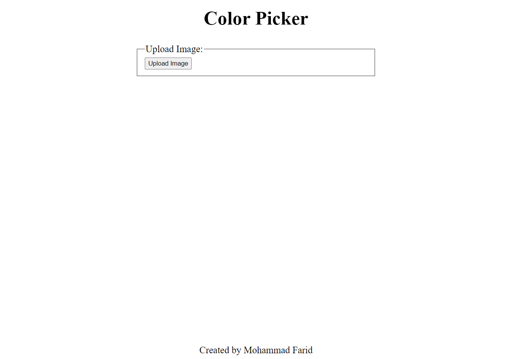

# color-picker

Live Demo:
https://mfarid4.github.io/colorpicker

### Objectives
Build a color picker that can extract color from image

### Asset
- quantize.js by [nrabinowitz](https://gist.github.com/nrabinowitz/1104622) and [cwey](https://gist.github.com/cwey/6200071)
- toast by [Adam Argyle](https://web.dev/building-a-toast-component/)

### Features
- produces palettes
- copy palette in (r,g,b) value